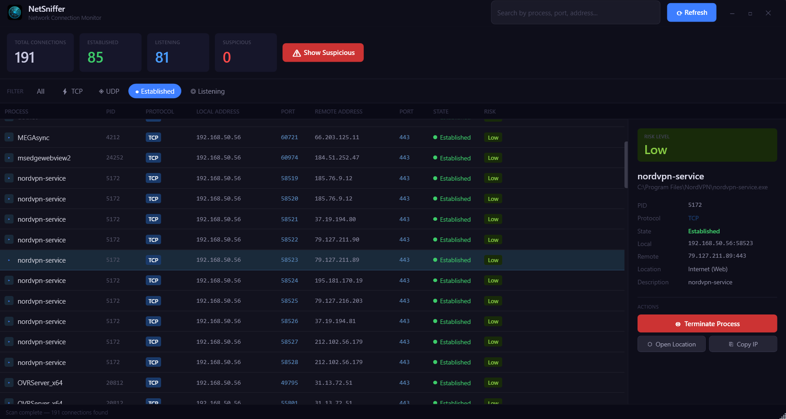

# NetSniffer
> A modern Windows network connection monitor built with C# and WPF (.NET 8)


<p align="center">
  
</p>

NetSniffer is a sleek, dark-themed Windows desktop application that monitors all active network connections in real time — TCP, UDP, listening ports, and remote endpoints — with colour-coded risk assessment and per-process detail.

---

## Features

- **Full connection scan** across all active network sockets:
  - TCP established connections
  - TCP listening ports
  - UDP listeners
- **Per-process attribution** — maps every connection to the owning process (name, PID, path)
- **Risk assessment** — Safe / Low / Medium / High / Suspicious based on port, process, and address heuristics
- **Live filtering** by protocol (TCP/UDP), state (Established/Listening), and free-text search
- **Detail panel** — full local/remote endpoints, state, PID, process path, remote location, description
- **Quick actions** — terminate the owning process, open file location in Explorer, copy remote IP
- **Suspicious quick filter** — one click to surface all elevated-risk connections
- **Modern dark UI** — pixel-matched to StartupSpy; built entirely in WPF with no third-party UI libraries

---

## Getting Started

### Prerequisites

- Windows 10/11
- [.NET 8 SDK](https://dotnet.microsoft.com/en-us/download/dotnet/8.0)
- Visual Studio 2022 (Community edition is free)

### Build & Run

```bash
git clone https://github.com/yourusername/NetSniffer.git
cd NetSniffer
dotnet build
dotnet run
```

> **Note:** Run as Administrator for full process attribution and access to all system sockets. The app manifest requests elevation automatically.

### Build a Release Executable

```bash
dotnet publish -c Release -r win-x64 --self-contained true -p:PublishSingleFile=true
```

The output will be a single `.exe` in `bin/Release/net8.0-windows/win-x64/publish/`.

---

## Project Structure

```
NetSniffer/
├── Models/
│   └── NetworkConnection.cs      # Data model with RiskLevel and ConnectionState enums
├── ViewModels/
│   └── MainViewModel.cs          # MVVM ViewModel, scan logic, filtering, commands
├── Services/
│   └── NetworkScannerService.cs  # netstat parsing, .NET NetworkInformation fallback, risk assessment
├── Converters/
│   └── Converters.cs             # WPF value converters (state colours, risk badges, etc.)
├── MainWindow.xaml               # Full UI layout
├── MainWindow.xaml.cs            # Code-behind (minimal — drag, minimize, close)
├── App.xaml / App.xaml.cs
├── app.manifest                  # UAC elevation request
└── NetSniffer.csproj
```

---

## Risk Assessment Logic

| Level      | Criteria                                                   |
|------------|------------------------------------------------------------|
| Safe       | Loopback or LAN address, known process on standard port   |
| Low        | Known safe port (80, 443, 53…) with any process           |
| Medium     | Listening on non-standard high port                        |
| High       | Unknown process (PID only, no name resolved)               |
| Suspicious | Connection to or from a known malicious/hacking port       |
| Unknown    | Doesn't match any heuristic                                |

---

## Tech Stack

| Technology | Purpose |
|---|---|
| C# 12 | Language |
| .NET 8 | Runtime |
| WPF | UI framework |
| MVVM pattern | Architecture |
| netstat / NetworkInformation | Connection enumeration |
| System.Diagnostics.Process | Process attribution |

---

## Roadmap

- [ ] Real-time auto-refresh with configurable interval
- [ ] GeoIP lookup for remote addresses (country flag + city)
- [ ] Per-connection VirusTotal IP reputation check
- [ ] Export report to CSV or HTML
- [ ] System tray with background monitoring and alerts
- [ ] Bandwidth per connection (bytes sent/received)

---

## License

MIT — feel free to use, modify, and distribute.
